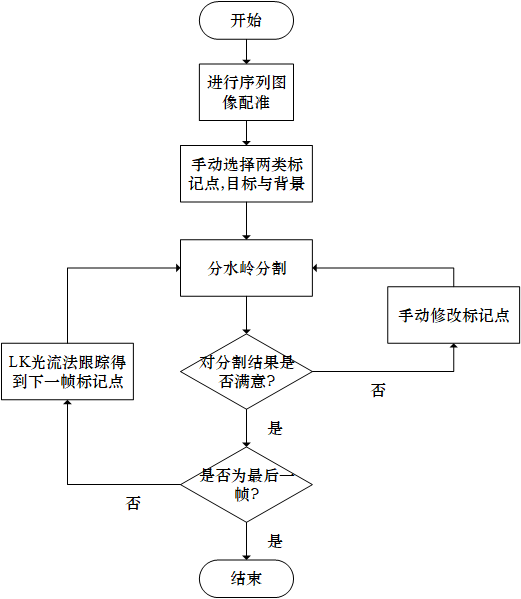
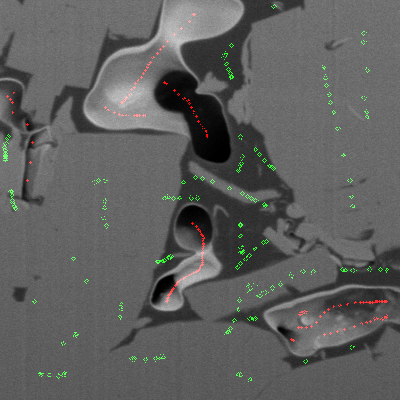
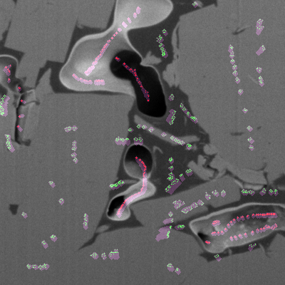
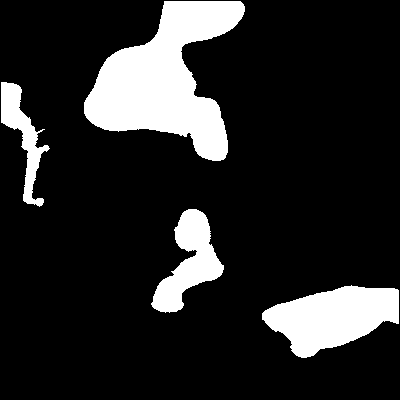
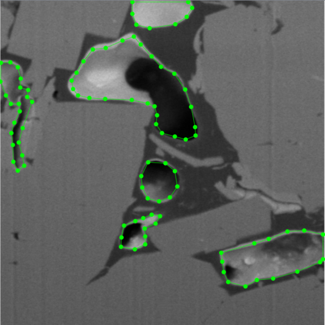
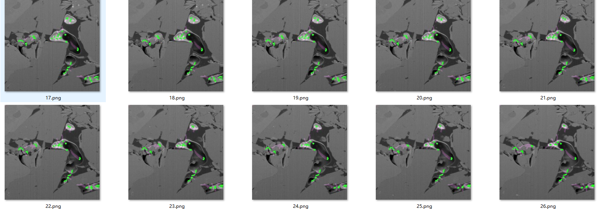
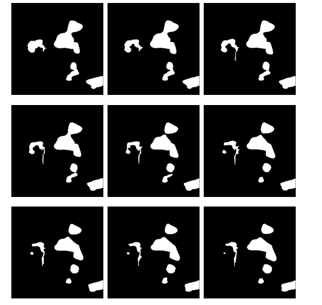

# Watershed-OpticalFlow-label
基于分水岭分割和光流的图像标注方法

## 简介
对于做深度学习中的图像分割任务来说 , 图像标注是一件繁琐的事情.对于成千上万张的图标注更是繁琐.
实验室主要做岩心CT序列图的分割 , 考虑到序列图有相关性. 所以提出了一种标注方法.
即提供一种利用序列图的层间相关性，减小标注工作量与难度且提高标注质量的结合光流与分水岭分割的岩心序列图像标注方法。
## 具体流程

## 使用
```imagePreProcess.py```文件中有针对CT序列图像的工具函数:   
- 灰度信息
- 边缘检测,梯度图像
- 灰度变化折线图生成
- XY,XZ等切面图
- K均值聚类
- 种子生长分割
- ......   

其中使用```watershed_optical_label```进行分水流+光流跟踪的交互式标注.
具体方法为"空格"下一帧,"esc"保存分割结果,按住ctrl擦除标记,鼠标左右点击增加标记.(详细步骤看程序注释)
## 示例
首先鼠标选取目标标记点,背景标记点.如下图:    
    
之后,"空格"取下一帧图像 , 注意此时选取的标记点可以用作分水岭分割,同时,标记点作为光流的角点,去跟踪下一帧,得到下一帧图像中对应的标记点的位置.如下图:    
    
透明部分显示了标记点的轨迹 , 同样可以ctrl+鼠标交互式修改不合理的标记点,之后按esc保存标注好的图片.
如下图为标注好的图片:    
    
这样根据流程图操作 , 大大减少了标注时间.因为传统的```labelme```等标注软件,都是需要选点连线 , 且对于序列图这种根本没有考虑利用相关性,奇慢无比.
## 对比结果  
为了显示这个方法的效率,跟```lableme```软件做了一个对比.   
### 操作对比
下图是```lableme```标注的过程,需要一步步选点,对于边缘部分处理的不好:   
    
下图是本方法标注20张连续CT图的示例:   
    
结果为:  
    

### 时间上的对比
LabelMe平均每张标注时间为184.74s   
本方法平均每张标注时间为25.71s   
效率明显提高，节省标注时间。


